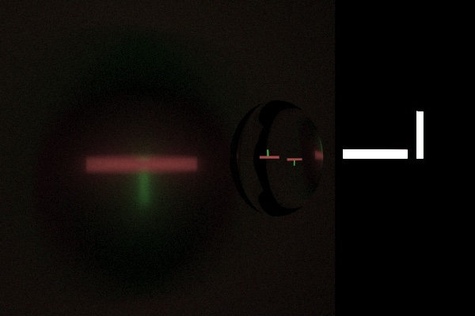
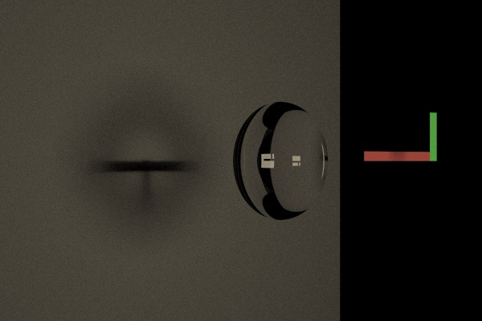
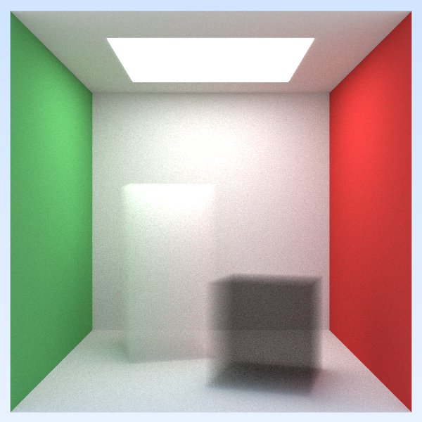
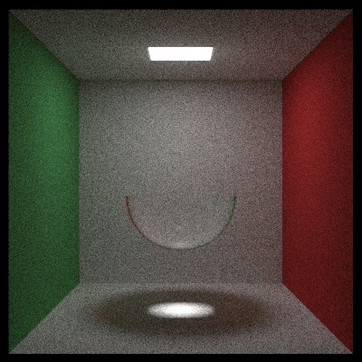
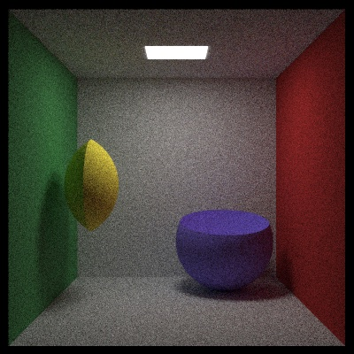

# Ray tracer

Based on https://raytracing.github.io

## Lenses

This image shows, from left to right, a screen, a lens, a horizontal red light source, and a vertical green light source. Both faces of the lens have the same radius of 27, it has a thickness of 10 and a refractive index of 1.5. That gives the lens a focal length of about 25.4. The distance between the screen and the lens is 80. The distance between the horizontal light source and the lens is 37, which is the distance an object should be according to the [thin less formula](https://en.wikipedia.org/wiki/Lens) for the image to be in focus and have a 2x magnification. The vertical light is farther way and should be out of focus. While the green bar is indeed slightly less sharp than the red one, the red bar isn't very sharp either. I think that's the case because the lens' is too thick for the thin less formula to be accurate (10 vs 27).

The setup in this image is almost the same, except that here the horizontal and vertical bars aren't light sources, but the light is provided by a bright light source that is just outside of the image to the right. The second change is that the distance between the lens and the horizontal bar as specified by the thin lens formula is now chosen to the face of the lens instead of to its center. This seems to result in a sharper image on the screen. 

Because of the non-zero size of the light source in this setup, some light gets past the lens and gives the images a faded appearance around the edge.

## Scenes showing various effects

Plane with balls:

Some more diversity of balls:

Explicit diffuse light:

Cornell box:

Cornell box with smokey/foggy boxes:

Constructive solid geometry:

| Glass dome | Intersection and difference |
| --- | --- |
|  |  |
